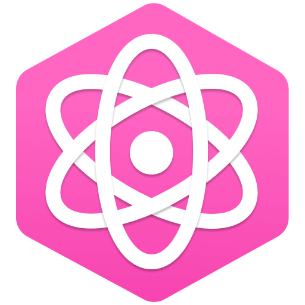

<p align="center">
  
</p>

<br>

## 💻 Technologies

Technologies used for the construction of this project:

- [NextJS](https://nextjs.org/)
- [React](https://reactjs.org/)
- [Styled components](https://styled-components.com/)
- [ESLint](https://eslint.org/)
- [Prettier](https://prettier.io/)
- [Husky](https://typicode.github.io/husky/#/)
- [Commitlint](https://commitlint.js.org/#/)
- [Commitzen](https://commitizen-tools.github.io/commitizen/)
- [Next PWA](https://github.com/shadowwalker/next-pwa#readme)
- [Jest](https://jestjs.io/)
- [React Testing library](https://testing-library.com/docs/react-testing-library/intro/)

## 🚀 Getting started

**You need to have node installed on your machine**

Create Next app using this boilerplate

yarn:
```bash
$ yarn create next-app -e https://github.com/marcosdoriguetto/boilerplate_nextjs
```

npx:
```bash
$ npx create-next-app -e https://github.com/marcosdoriguetto/boilerplate_nextjs
```

---

<p align="center">Made with 💜 by Marcos in <a href="https://github.com/willianjusten" style="color: #8b22a8">Willian Justen's</a> <a href="https://www.youtube.com/playlist?list=PLlAbYrWSYTiPlXj6USip_lCPzONUATJbE" style="color: #f94eb5">NextJS, GraphQL na prática</a> course</p>